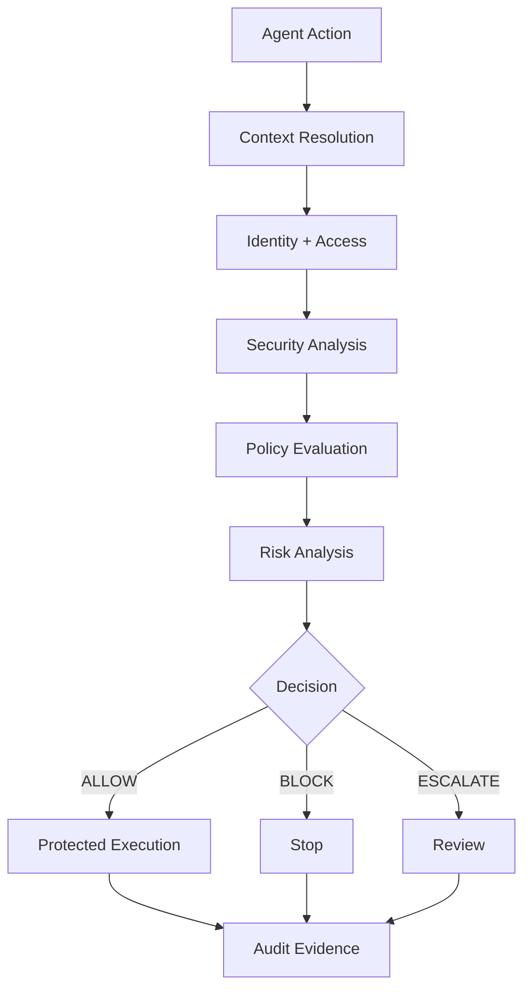

# Aegisora

## Zero-trust security and governance for autonomous AI agents.

Aegisora is a runtime governance layer that evaluates and enforces agent actions before they cross protected execution boundaries.

## Start building

- [Getting Started](./getting-started/)
- [Architecture](./architecture/)
- [Security](./security/)
- [Governance](./governance/)
- [Policies](./policies/)
- [Integrations](./integrations/)
- [SDK](./sdk/)
- [API Reference](./api/)
- [Examples](./examples/)
- [Reference](./reference/)

## Governance pipeline

## Ecosystem

| Layer | Role |
| --- | --- |
| Aegisora Runtime | Security, governance, policy, risk, decisions, enforcement. |
| Agent Framework | Orchestration and workflow execution. |
| Model Provider | Model inference and generation. |
| Tools / APIs | External execution surfaces governed by Aegisora. |

Aegisora is designed to work with the AI stack developers already use rather than replace it.